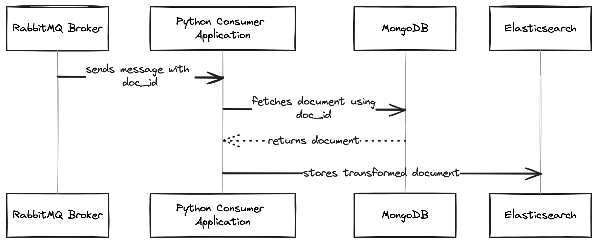

# Catalog-as-a-Service (CaaS)

A dedicated service for adding on_search catalog in index database

## Tech Stack

| Type               | Technologies           |
|:-------------------|:-----------------------|
| **Queue**          | Rabbitmq               |
| **Event Consumer** | Python                 |
| **Database**       | ElasticSearch, MongoDB |

## Design



### Apply mapping to es

```shell
make apply-es-mapping index_name=locations file_location=mappings/locations_mappings.json
```